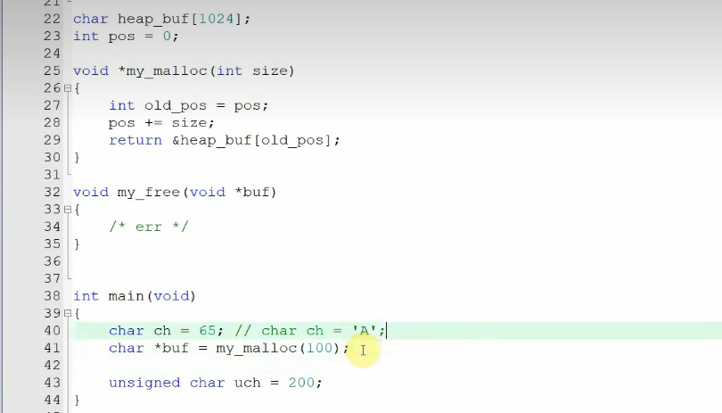
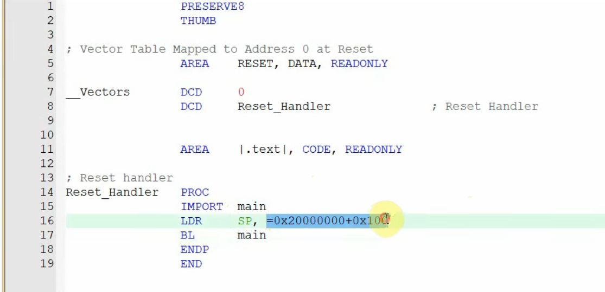
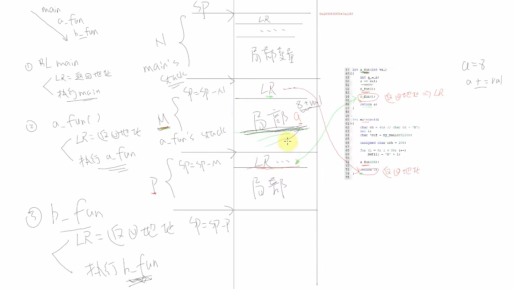
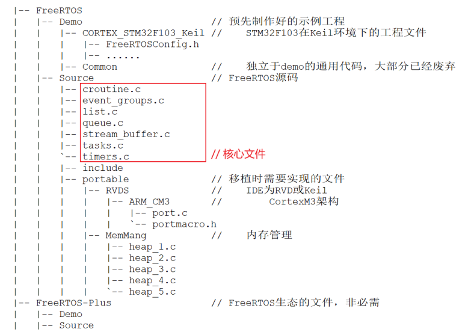

<!--
 * @Date: 2024-09-07
 * @LastEditors: GoKo-Son626
 * @LastEditTime: 2024-09-08
 * @FilePath: \freeRTOS\1.RTOS-BK.md
 * @Description: 
-->
# RTOS-Basic

Real-Time Operating System Basic Knowledge

**1. MCU RTOS Architecture**

- CPU Architecture:        ARM and RISC_V
- System:           FreeRTOS and RT-Thread

**2. Heap and Stack**

- Heap is the basic of RTOS.
- Stack is a piece of free memory, it can be managed, taken from it and released when you used up it.








**3. First_Simplify_FreeRTOS:**

Download the [official source](https://www.freertos.org/), then delete unnecessary files and code, leave the important part



## CODE

```c
//Empty
```

## [RTOS](/Files/FreeRTOS/)


